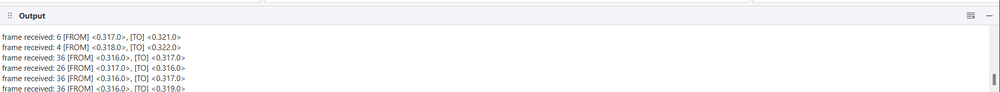

vc418_client
=====

Python PySide6 Application. Requests data from server and renders the data frame by frame.

## Overview

The application is divided into 4 sections, programs, preview, properties and output

### 1. Programs

Holds the programs we want to run animations for
- Right click on section to create program
- double on program to open preview
- click on program to see properties

### 2. Preview

Holds opened programs.
- Toggle between tabs to see various programs
- Click tab to see program properties
- Use control buttons to step through animation frames, see how values change in properties section. Use input to jump to frame
- `Run` sends request to server. Response and parsed and shown on the canvas. response is saved to a temporal file `response.json` at the root directory fo the client. this file can be changed in settings. it must be a json file. 
- `Reload` loads data from the most recently run algorithm. 
- animation framerate can be changed in settings.

### 3. Properties

Show properties of the program in focus.
- change processes to run larger programs
- See the data at each frame in of the algorithm (`Table 1`). data changes as when the player is playing. Data is the value from the combine function.
- See total timeline for any particular process (`Table 2`). Select the processes and see how the values change.

### 4. Output

Logs data of application processes and error messages.
- can be minimized (use button or go via menu bar)
- can be cleared

### 5. Status bar

- shows server state
    - `online`: server is on - 🟦 Online
    - `offline`: server is off - ⬛ offline
    - `working`: request has been made to server to get data
- Toggle output: show and hide

### 6. Menu Bar
- `File -> Start Erlang Server`: starts the erlang server with the configured parameters
- `File -> Settings`: Configure application settings

    - Adjust the animation framerate
    - Change the temporal storage file
    - Set the server path Required
    - Set the rebar location. Could be the location of `rebar3.cmd` or type in `rebar3`. The former is preferable.
    - Change the http protocol or domain or port number depending on where we want to fetch data from.

# Points to Note
1. Server must be live before a simulation can be run. Even if it is not a local server
2. you can reload data from the temporal file without having the server on.
3. There are bugs everywhere. thread lightly.
4. Enjoy!!!